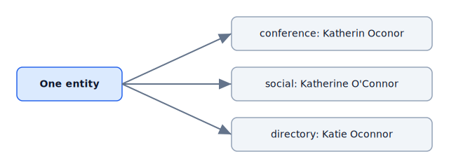
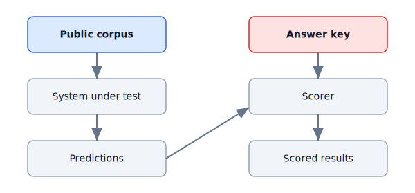

# SynthWorld baselines and benchmark demonstrations

These are deliberately naive reference baselines: each score illustrates what its benchmark *measures*, not the state of the art. Every number below is reproducible from `uv run python -c "from synthworld import run_all_baselines; ..."` or the command in [Reproduce](#reproduce). All data is safely synthetic.

## Reproduce

```bash
uv run python examples/generate_benchmarks_doc.py
```

This regenerates the results table and the SVG visuals under `assets/`. `make baselines` checks the document and its assets for drift in CI.

## Baseline results

| Baseline | Task | Metric | Score | Notes |
|---|---|---|---|---|
| Regex extractor | Exact-span PII extraction | span F1 | 0.6301 | P=1.00 R=0.46 over 150 gold spans; regex catches email, phone, and national-ID patterns and misses address, date-of-birth, username, employer, and education spans |
| Exact-string entity matcher | Entity resolution (adversarial pack) | pairwise F1 | 0.5 | P=1.00 R=0.33 over 9 same-entity pairs; exact strong-identifier matching is precise but links only records that already share an email or username |
| Normalised/fuzzy entity matcher | Entity resolution (adversarial pack) | pairwise F1 | 0.5455 | P=0.38 R=1.00 over 9 same-entity pairs; fuzzy name and shared-address matching recovers more links but over-merges common names and twins at one address |
| Reciprocity relationship heuristic | Relationship inference | edge F1 | 1.0 | P=1.00 R=1.00 over 3 planted edges; 0 false edges — requiring reciprocal evidence correctly rejects the unilateral association controls |
| Severity-only risk adapter | Breach-risk calibration | band accuracy | 0.4 | 4/10 bands correct, mean absolute score error 21.0; ignoring data-class weight under-calibrates against the documented formula |

## Why SynthWorld, not a row generator

| | Row-oriented fake data (Faker/SDV) | SynthWorld |
|---|---|---|
| Records | Independent rows | Connected personas |
| Linkage | None | Planted relationship edges and adversarial identity records that resolve to one entity |
| Answer key | None | Exact-span, entity, relationship, and risk truth, physically separated from public input |

## What the visuals show

### A. One persona, conflicting public records



*One real person surfaces under three spellings across three sources; the answer key knows they are one entity.*

### B. Broker removal and reappearance timeline


*A listing confirmed removed can reappear at a later virtual date; the benchmark plants this so removal-tracking systems can be tested.*

### C. Public input vs evaluator truth



*Products consume only the public projection; evaluators join the separately serialized truth to score.*

## Size and limits

- The benchmarks are frozen at seed `20260719`, 10 personas (18 records for the adversarial entity-resolution pack).
- Baselines are intentionally simple and are NOT state of the art.
- Scores illustrate the benchmark's discriminative power, not system quality.
- Numbers change only through a deliberate benchmark-version transition.

See [DATA_DICTIONARY.md](DATA_DICTIONARY.md) for field definitions and [GOLDEN_REVIEW.md](GOLDEN_REVIEW.md) for the frozen benchmark review record.
