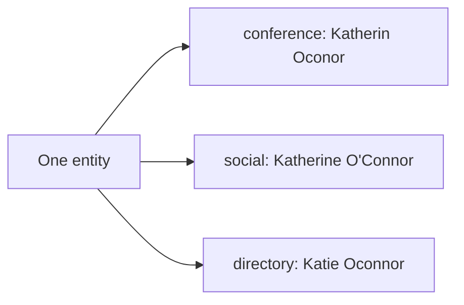
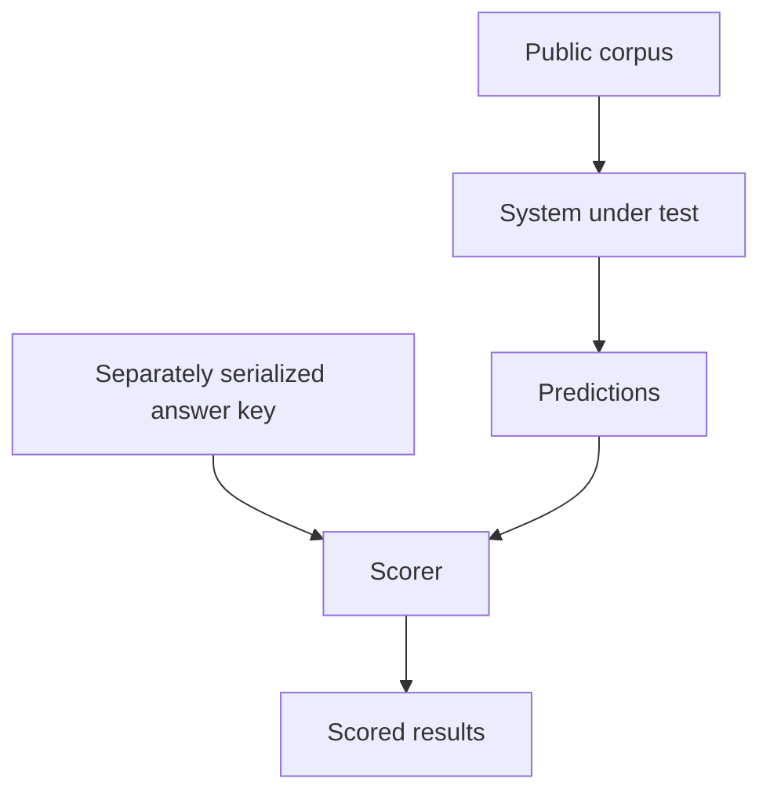

# SynthWorld baselines and benchmark demonstrations

These are deliberately naive reference baselines: each score illustrates what its benchmark *measures*, not the state of the art. Every number below is regenerated from the public-only baseline adapters by the command in [Reproduce](#reproduce). All data is safely synthetic.

## Reproduce

```bash
uv run python examples/generate_benchmarks_doc.py
```

`make baselines` checks this file for drift in CI.

## Baseline results

| Baseline | Task | Metric | Score | Notes |
|---|---|---|---|---|
| Regex extractor | Exact-span PII extraction | span F1 | 0.6301 | P=1.00 R=0.46 over 150 gold spans; regex catches email, phone, and national-ID patterns and misses address, date-of-birth, username, employer, and education spans |
| Exact-string entity matcher | Entity resolution (adversarial pack) | pairwise F1 | 0.5 | P=1.00 R=0.33 over 9 same-entity pairs; exact strong-identifier matching is precise but links only records that already share an email or username |
| Normalised/fuzzy entity matcher | Entity resolution (adversarial pack) | pairwise F1 | 0.5455 | P=0.38 R=1.00 over 9 same-entity pairs; fuzzy name and shared-address matching recovers more links but over-merges common names and twins at one address |
| Reciprocity relationship heuristic | Relationship inference | edge F1 | 1.0 | P=1.00 R=1.00 over 3 planted edges; 0 false edges — requiring reciprocal evidence correctly rejects the unilateral association controls |
| Severity-only risk adapter | Breach-risk calibration | band accuracy | 0.4 | 4/10 bands correct, mean absolute score error 21.0; ignoring data-class weight under-calibrates against the documented formula |

## Asteria Agentic v1 baselines

Both baselines consume only the public bundle. Always-deny shows why accuracy alone is misleading on a deny-heavy fixture; the current-state baseline shows why final audit state cannot replace historical replay.

| Baseline | Metric | Score | Support |
|---|---|---|---|
| Always deny | authorization_decision_accuracy | 0.6364 | 11 |
| Always deny | authorization_decision_f1 | undefined | 4 |
| Always deny | delegation_chain_integrity | 0.0 | 11 |
| Always deny | provenance_completeness | 0.7273 | 11 |
| Always deny | provenance_exact_match | 0.3636 | 11 |
| Always deny | provenance_precision | 0.8409 | 44 |
| Audit-time current state | authorization_decision_accuracy | 0.6364 | 11 |
| Audit-time current state | authorization_decision_f1 | 0.3333 | 4 |
| Audit-time current state | delegation_chain_integrity | 0.4545 | 11 |
| Audit-time current state | provenance_completeness | 0.5455 | 11 |
| Audit-time current state | provenance_exact_match | 0.4545 | 11 |
| Audit-time current state | provenance_precision | 0.9714 | 35 |

## Enterprise authorization baselines

Each of these consumes the shipped reference pack for its family and deliberately fails one dimension, so the score shows what the dimension detects. Only the metrics that separate the baselines are listed; every family publishes more, each with its own denominator and no aggregate.

The reference packs are conformance fixtures, not statistical benchmarks — denominators here are in the tens, and their evaluator answer keys ship in the contract packages. A perfect score is evidence that an adapter conforms, never that a system generalises.

| Family | Baseline | Metric | Score | Support |
|---|---|---|---|---|
| Enterprise agentic | Enterprise decision only | enterprise_decision_accuracy | 1.0 | 20 |
| Enterprise agentic | Enterprise decision only | final_decision_accuracy | 0.3 | 20 |
| Enterprise agentic | Enterprise decision only | failure_reason_exact_match | 0.3 | 20 |
| Enterprise agentic | Enterprise decision only | delegation_gate_accuracy | 0.6 | 10 |
| Enterprise agentic | Union owner authority | enterprise_decision_accuracy | 1.0 | 20 |
| Enterprise agentic | Union owner authority | final_decision_accuracy | 0.95 | 20 |
| Enterprise agentic | Union owner authority | failure_reason_exact_match | 0.95 | 20 |
| Enterprise agentic | Union owner authority | delegation_gate_accuracy | 1.0 | 10 |
| Enterprise agentic | Ignore lifecycle and revocation | enterprise_decision_accuracy | 1.0 | 20 |
| Enterprise agentic | Ignore lifecycle and revocation | final_decision_accuracy | 0.85 | 20 |
| Enterprise agentic | Ignore lifecycle and revocation | failure_reason_exact_match | 0.85 | 20 |
| Enterprise agentic | Ignore lifecycle and revocation | delegation_gate_accuracy | 0.9 | 10 |
| Enterprise agentic | Discard retained evidence | enterprise_decision_accuracy | 1.0 | 20 |
| Enterprise agentic | Discard retained evidence | final_decision_accuracy | 1.0 | 20 |
| Enterprise agentic | Discard retained evidence | failure_reason_exact_match | 1.0 | 20 |
| Enterprise agentic | Discard retained evidence | delegation_gate_accuracy | 1.0 | 10 |
| Contextual access | Ignore contextual predicates | decision_accuracy | 1.0 | 10 |
| Contextual access | Ignore contextual predicates | stale_context_decision_accuracy | 1.0 | 1 |
| Contextual access | Ignore contextual predicates | canonical_event_application_exact_match | 1.0 | 10 |
| Contextual access | Ignore contextual predicates | predicate_outcome_accuracy | 0.3429 | 70 |
| Contextual access | Trust presented feed | decision_accuracy | 0.9 | 10 |
| Contextual access | Trust presented feed | stale_context_decision_accuracy | 0.0 | 1 |
| Contextual access | Trust presented feed | canonical_event_application_exact_match | 1.0 | 10 |
| Contextual access | Trust presented feed | predicate_outcome_accuracy | 0.9857 | 70 |
| Contextual access | Initial snapshot only | decision_accuracy | 0.5 | 10 |
| Contextual access | Initial snapshot only | stale_context_decision_accuracy | 0.0 | 1 |
| Contextual access | Initial snapshot only | canonical_event_application_exact_match | 0.2 | 10 |
| Contextual access | Initial snapshot only | predicate_outcome_accuracy | 0.9143 | 70 |
| Contextual access | Drop delayed events | decision_accuracy | 0.9 | 10 |
| Contextual access | Drop delayed events | stale_context_decision_accuracy | 0.0 | 1 |
| Contextual access | Drop delayed events | canonical_event_application_exact_match | 0.2 | 10 |
| Contextual access | Drop delayed events | predicate_outcome_accuracy | 0.9857 | 70 |
| Authority-change governance | Final state implies valid | governance_authorisation_accuracy | 0.4167 | 12 |
| Authority-change governance | Final state implies valid | structured_rationale_accuracy | 1.0 | 12 |
| Authority-change governance | Final state implies valid | policy_control_accuracy | 1.0 | 12 |
| Authority-change governance | Trust recorded approval | governance_authorisation_accuracy | 0.6667 | 12 |
| Authority-change governance | Trust recorded approval | structured_rationale_accuracy | 1.0 | 12 |
| Authority-change governance | Trust recorded approval | policy_control_accuracy | 1.0 | 12 |
| Authority-change governance | Use latest policy | governance_authorisation_accuracy | 0.6667 | 12 |
| Authority-change governance | Use latest policy | structured_rationale_accuracy | 0.3333 | 12 |
| Authority-change governance | Use latest policy | policy_control_accuracy | 0.3333 | 12 |
| Continuous assurance | Latest observed state | drift_classification_accuracy | 0.1429 | 7 |
| Continuous assurance | Latest observed state | finding_detection_recall | 0.1429 | 7 |
| Continuous assurance | Latest observed state | false_negative_rate | 0.8571 | 7 |
| Continuous assurance | Effective time is detection time | drift_classification_accuracy | 1.0 | 7 |
| Continuous assurance | Effective time is detection time | finding_detection_recall | 0.0 | 7 |
| Continuous assurance | Effective time is detection time | false_negative_rate | 1.0 | 7 |
| Continuous assurance | Never clear findings | drift_classification_accuracy | 1.0 | 7 |
| Continuous assurance | Never clear findings | finding_detection_recall | 1.0 | 7 |
| Continuous assurance | Never clear findings | false_negative_rate | 0.0 | 7 |

## Ambiguity v2 error floor

The v2 pack's difficulty is computed, not claimed: its **genie floor** is the Bayes error of the generator itself - the accuracy of an optimal solver restricted to the modelled observation (the rendered values, the comparable structure and the true prevalence) and holding the public law. Read the pack as a **hardness certificate**, not a capability leaderboard: the ceiling `1 - floor` is the most any system can achieve, and transcribing the published rule already reaches it, so the informative number is a resolver's **gap to the genie**. A score above the ceiling is exploiting signal the model says should not exist; a score within the genie's confidence interval is, statistically, at ceiling.

- Published floor: **0.1098** (±0.0073, 95% Wilson interval)
- Ceiling `1 - floor`: **0.8902**
- Technique premium: **0.0728** (gate ≥ 0.05)
- Floor band: [0.08, 0.12]
- Estimated over 7030 pairs from 100 seeds
- Decision digest: `f2c68dd5c7f9ed1d49d63af182ce339c`

The digest binds these numbers to every decision-relevant constant; any parameter move invalidates them until `examples/compute_ambiguity_floor.py` is rerun.

## Why SynthWorld, not a row generator

| | Row-oriented fake data (Faker/SDV) | SynthWorld |
|---|---|---|
| Records | Independent rows | Connected personas |
| Linkage | None | Planted relationship edges and adversarial identity records that resolve to one entity |
| Answer key | None | Exact-span, entity, relationship, risk, and agent-authority truth, physically separated from public input |

## What the visuals show

### A. One persona, conflicting public records


```mermaid
flowchart LR
    entity["One entity"]
    entity --> record0["conference: Katherin Oconor"]
    entity --> record1["social: Katherine O'Connor"]
    entity --> record2["directory: Katie Oconnor"]
```

*One real person surfaces under three spellings across three sources; the answer key knows they are one entity.*

### B. Broker removal and reappearance timeline


```mermaid
flowchart LR
    state0["2026-01-22<br/>found"] --> state1["2026-01-27<br/>removal_requested"] --> state2["2026-02-26<br/>confirmed_removed"] --> state3["2026-04-12<br/>reappeared"]
```

*A listing confirmed removed can reappear at a later virtual date; the benchmark plants this so removal-tracking systems can be tested.*

### C. Public input vs evaluator truth


```mermaid
flowchart TD
    public["Public corpus"] --> sut["System under test"]
    sut --> predictions["Predictions"]
    answers["Separately serialized answer key"] --> scorer["Scorer"]
    predictions --> scorer
    scorer --> results["Scored results"]
```

*Products consume only the public projection; evaluators join the separately serialized truth to score.*

## Size and limits

- The benchmarks are frozen at seed `20260719`, 10 personas (18 records for the adversarial entity-resolution pack).
- Asteria Agentic v1 is separately frozen at 24 events and 11 action attempts; it is a conformance fixture, not a statistical leaderboard.
- Baselines are intentionally simple and are NOT state of the art.
- Scores illustrate the benchmark's discriminative power, not system quality.
- Numbers change only through a deliberate benchmark-version transition.

See [DATA_DICTIONARY.md](DATA_DICTIONARY.md) for field definitions and [GOLDEN_REVIEW.md](GOLDEN_REVIEW.md) for the frozen benchmark review record.
